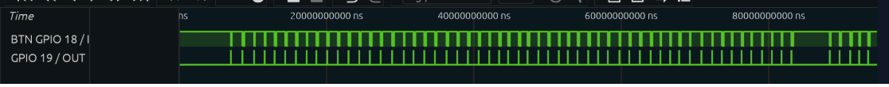
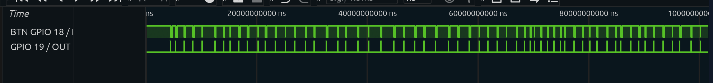

# App 3 Analysis — Interrupts & Bottom-Half Real-Time Responses

## Run modes (`WITH_LOAD`)

### Load 0 Baseline Environment

| Path | Typical Latency | Worst Latency |
| :--- | :--- | :--- |
| **Direct Notification** | 24–30 µs | 2616 µs |
| **Binary Semaphore** | 2800–3200 µs | 3198 µs |



**Measured Baseline Latency (logic analyzer):**
* Binary Semaphore Path (WITH_LOAD 0): ~2800–3200 µs, worst-case up to 3198 µs  
* Direct Task Notification Path (WITH_LOAD 0): ~24–30 µs, worst-case up to 2616 µs  

---

### Load 1 Loaded Environment

| Path | Typical Latency | Worst Latency |
| :--- | :--- | :--- |
| **Direct Notification** | 24–35 µs | 18,843 µs |
| **Binary Semaphore** | 2800–3500 µs | 10,369 µs |



---

### Comparative Metrics Overview

| Path | Load 0 Typical | Load 0 Worst | Load 1 Typical | Load 1 Worst |
| :--- | :--- | :--- | :--- | :--- |
| **Direct Notification** | 24–30 µs | 2616 µs | 24–35 µs | 18,843 µs |
| **Binary Semaphore** | 2800–3200 µs | 3198 µs | 2800–3500 µs | 10,369 µs |

> Typical latency stays mostly stable across both runs. The major change is worst-case behavior under load. Direct notifications remain the fastest average path, but show large spike variances. Binary semaphores are slower overall but slightly more stable under heavy loads.

> *Note: Load 0 run includes a small idle gap between samples, which slightly inflates worst-case timing due to a non-continuous press. While pressing the buttons I had to step away for a little bit*

---

## Engineering analysis 

### 1. What's in your ISR? What's NOT?

Everything inside `button_isr` is strictly bounded interrupt work.

* `int64_t now = esp_timer_get_time();`  
  Gets timestamp right when the interrupt fires for latency measurement.

* `if (now - last_edge_us < DEBOUNCE_US) return;`  
  Basic debounce so one button press doesn’t trigger multiple interrupts.

* `last_edge_us = now;`  
  Updates debounce time after a valid edge.

* `gpio_set_level(ISR_PULSE_GPIO, 1);`  
  Toggles GPIO 19 so the logic analyzer can clearly see ISR start.

* `isr_entry_time_us = now;`  
  Saves timestamp for later latency calculation in the bottom-half task.

* `presses_observed++;`  
  Counts how many valid interrupts happened.

* `BaseType_t higher_woken = pdFALSE;`  
  Flag used by FreeRTOS to see if we need a context switch after ISR.

* `xSemaphoreGiveFromISR(btn_sem, &higher_woken);`  
  Wakes the semaphore-based task.

* `vTaskNotifyGiveFromISR(task_notif_handle, &higher_woken);`  
  Wakes the direct-notification task (faster path).

* `gpio_set_level(ISR_PULSE_GPIO, 0);`  
  Ends the pulse so ISR duration is visible on the logic analyzer.

* `portYIELD_FROM_ISR(higher_woken);`  
  Forces immediate scheduling if a higher-priority task was unblocked.

#### What is NOT in the ISR
* No blocking calls (`printf`, `ESP_LOGI`)
* No loops or heavy computation  
* No dynamic memory allocation or unsafe FreeRTOS calls
* JPL Rules of 10

---

### 2. Binary semaphore vs direct task notification

Direct task notifications are faster.

Binary semaphores go through the FreeRTOS queue, which adds overhead and increases latency under load.

---

### 3. Latency under load

The increase in worst-case latency under `WITH_LOAD = 1` comes from CPU contention on Core 1:

P stands for Priority
```text
========================================================================================
CPU 1: No Load (ms)
========================================================================================
0         10        20        30        40        50        60        70        80
+---------+---------+---------+---------+---------+---------+---------+---------+----->
[█] Button ISR Fires Instantly
   [█] Task Sem (P12) runs bottom half
   [█] Task Notif (P12) runs bottom half

========================================================================================
CPU 1: Load (ms)  — (Scenario: Button ISR fires mid-execution after Task A releases)
========================================================================================
0         10        20        30        40        50        60        70        80
+---------+---------+---------+---------+---------+---------+---------+---------+----->
[█████████] Task A (P15) runs and holds CPU core
          [█] Button ISR fires and requests context
             [█] Task Sem (P12) bottom half executes
             [█] Task Notif (P12) bottom half executes
                [██████████] Task B (P10) resumes execution after Safety tasks 
                           [█████████████████████] Task C (P5) runs
                                                 [████████████████████████████] Task D (P2)
